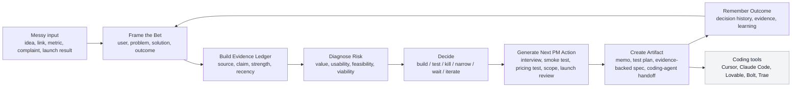

# David

<p align="right">
  <strong>Language:</strong>
  English |
  <a href="./README.zh-CN.md">简体中文</a>
</p>

David is an AI PM coworker for indie builders.

It turns messy ideas, market signals, and founder context into evidence-backed product judgment: the Bet, the riskiest assumption, the right decision, and the next PM action.

> Current app status: this repo includes a working validation prototype. The page currently uses `IndiePM Clinic` / `AI PM Doctor` offer copy to test paid/manual diagnosis demand. That page is a market test, not the final David product experience or final naming decision.

## Why David Exists

AI coding tools made building fast. They did not make product judgment easy.

Solo builders can now ship a prototype in hours, but still struggle with the decisions that determine whether building is worth it:

- Who exactly is this for?
- Is the pain real, urgent, and repeated?
- What evidence exists beyond compliments and vague interest?
- Should this become a spec, a smoke test, an interview script, a pricing test, or a kill decision?
- After launch, what did the market actually teach us?

David exists because indie builders do not need another way to generate more output. They need a senior product judgment loop before and after they build.

## Target Product Position

David is not a PRD generator, idea generator, roadmap tool, generic chatbot, or coding agent.

The final product should sit around coding tools and improve the product context they receive. The current prototype only tests demand for this promise.

| Tool type | What it does | David's target role |
|---|---|---|
| Coding agents | Build from prompts/specs | Decides whether the Bet deserves build time |
| PRD generators | Turn an assumed decision into a document | Blocks premature specs when evidence is weak |
| Research tools | Collect or summarize signals | Connects evidence to risk, decision, and next action |
| Generic chatbots | Answer broad questions | Maintains a PM workflow: Bet, evidence, decision, memory |

## Core Workflow



## The Bet

The Bet is David's core product object.

```text
I believe user X has problem Y.
Solution Z can create value and business outcome B.
This is supported or disproven by evidence E.
The riskiest assumption is A.
The next action is N.
```

David should never jump from raw idea to build spec. It should first understand the Bet, inspect evidence, and decide the right PM move.

Terminology:

- Bet: the product judgment unit, including user, problem, solution guess, evidence, risk, and next action.
- Evidence Ledger: the traceable record of sources, claims, strength, recency, and relationship to a Bet.
- Human-in-the-loop: manual review or delivery remains available for high-stakes diagnosis while the product is still validating judgment quality.

## Current Repository State

This repository currently contains:

- product source of truth in `docs/specs/`
- frontend and validation-page design direction in `docs/frontend/`
- backend and architecture notes in `docs/backend/`
- market and platform research in `docs/research/`
- a working Next.js validation prototype in `app/`
- shared diagnosis/domain logic in `src/lib/`

The prototype can currently:

- render a bilingual validation page
- capture case intake
- generate a rule-based diagnosis preview
- show a report page for generated previews
- capture leads
- capture paid diagnosis intent
- optionally return English Stripe payment links when configured
- optionally send intake, diagnosis, lead, and paid-intent records to a webhook sink

The prototype does not yet have durable storage, authentication, a real evidence-ingestion pipeline, or an LLM-backed PM reasoning engine. Reports and captured records use the current in-memory store and are lost when the process restarts.

## Product Maturity

| Layer | Current state | Target state |
|---|---|---|
| Landing page | Working validation test | Not final UX |
| Intake | Form-based case capture | Natural conversation plus structured context |
| Diagnosis | Rule-based preview | Evidence-backed PM reasoning workflow |
| Evidence | User-provided text only | Source-backed Evidence Ledger |
| Storage | In-memory local store | Durable database and product memory |
| Delivery | Manual paid diagnosis validation | AI PM coworker with human-in-the-loop where needed |
| Handoff | Conceptual | Evidence-backed specs for coding agents |

## Roadmap

| Stage | Focus | Expected outcome |
|---|---|---|
| Now | Validation prototype, manual paid diagnosis test, rule-based preview | Learn whether founders want this judgment loop enough to pay or apply |
| Next | Durable storage, real case review workflow, admin surface | Stop losing validation data and make manual delivery reliable |
| Next next | Evidence Ledger, Bet-centered diagnosis workflow, risk and decision memory | Turn the prototype into the first real PM coworker workflow |
| Later | Agentic market research, evidence-backed specs, coding-agent handoff | Make David a durable product system around builder execution tools |

## Repository Structure

```text
app/                 Next.js pages, routes, and API endpoints
src/                 Shared product/backend logic
assets/              Tracked product and design assets
docs/
  specs/             Product source of truth
  frontend/          Visual and UX direction
  backend/           API, data, architecture, and agent notes
  research/          Market findings and accepted evidence
  repo/              Repo maps and operating notes
README.md            English repo introduction
README.zh-CN.md      Simplified Chinese repo introduction
package.json         Scripts and dependencies
```

Detailed structure: [docs/repo/repo-map.md](docs/repo/repo-map.md)

## Development

Prerequisites:

- Node.js 20+ recommended
- npm 10+

```bash
npm install
npm run dev
npm run typecheck
npm run build
```

The local dev server defaults to [http://localhost:3000](http://localhost:3000).

Environment variables are documented in [.env.example](.env.example).

## Working Rule

Evidence comes before PRD.

If a Bet is not build-ready, David should generate the next evidence test instead of a premature build spec.
