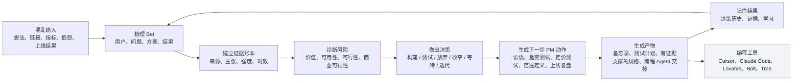

# David

<p align="right">
  <strong>语言：</strong>
  <a href="./README.md">English</a> |
  简体中文
</p>

David 是一个面向独立开发者的 AI PM 同事。

它把混乱的想法、市场信号和创始人上下文，转化成有证据支撑的产品判断：当前 Bet 是什么，最大的风险假设是什么，应该做什么决策，以及下一步 PM 动作是什么。

> 当前应用状态：这个仓库包含一个可运行的验证原型。当前页面使用 `IndiePM Clinic` / `AI PM Doctor` 作为测试用 offer 文案，用来验证付费/人工诊断需求；它不是最终 David 产品体验，也不是最终命名决定。

## 为什么需要 David

AI 编程工具让构建变快了，但没有让产品判断变容易。

独立开发者现在可以在几个小时内做出原型，但仍然会卡在真正决定成败的产品问题上：

- 这个产品到底给谁用？
- 痛点是否真实、紧迫、反复出现？
- 除了“听起来不错”之外，有没有行为证据？
- 现在应该写规格、做烟雾测试、访谈、定价测试，还是直接停止？
- 上线之后，市场到底反馈了什么？

David 存在的原因是：独立开发者不需要更多输出机器，他们需要在构建前后有一个高级产品判断循环。

## 目标产品定位

David 不是 PRD 生成器、点子生成器、路线图工具、通用聊天机器人，也不是编程 Agent。

最终产品应该围绕编程工具工作，提升交给编程工具的产品上下文质量。当前原型只是在验证这个承诺是否有需求。

| 工具类型 | 它做什么 | David 的目标角色 |
|---|---|---|
| 编程 Agent | 根据 prompt/spec 构建 | 判断这个 Bet 是否值得投入构建时间 |
| PRD 生成器 | 把已假设成立的决策写成文档 | 在证据不足时阻止过早写规格 |
| 研究工具 | 收集或总结信号 | 把证据连接到风险、决策和下一步动作 |
| 通用聊天机器人 | 回答广泛问题 | 维护 PM 工作流：Bet、证据、决策、记忆 |

## 核心工作流



## Bet 是什么

Bet 是 David 的核心产品对象。

```text
我相信用户 X 有问题 Y。
方案 Z 可以创造用户价值和业务结果 B。
这被证据 E 支持或反驳。
当前最大的风险假设是 A。
下一步动作是 N。
```

David 不应该从原始想法直接跳到构建规格。它应该先理解 Bet、检查证据，并判断正确的 PM 动作。

术语说明：

- Bet：产品判断单元，包含用户、问题、方案、证据、风险和下一步动作。
- Evidence Ledger：证据账本，记录来源、主张、强度、时效和关联 Bet。
- human-in-the-loop：关键诊断或交付阶段保留人工参与。

## 当前仓库状态

这个仓库目前包含：

- `docs/specs/` 中的产品事实和核心规格
- `docs/frontend/` 中的前端与验证页设计方向
- `docs/backend/` 中的后端和架构说明
- `docs/research/` 中的市场和平台研究
- `app/` 中的 Next.js 验证原型
- `src/lib/` 中的共享诊断/领域逻辑

当前原型可以：

- 渲染中英文双语验证页
- 捕获案例 intake
- 生成基于规则的诊断预览
- 展示已生成预览的报告页
- 捕获邮箱线索
- 捕获付费诊断意向
- 配置后可返回英文 Stripe 支付链接
- 可选把 intake、诊断、线索和付费意向记录发送到 webhook

当前原型还没有持久化存储、身份系统、真实证据摄取管线，也没有 LLM 驱动的 PM 推理引擎。报告和捕获记录仍然使用当前的内存存储，进程重启后会丢失。

## 产品成熟度

| 层级 | 当前状态 | 目标状态 |
|---|---|---|
| 落地页 | 可运行的验证测试 | 不是最终 UX |
| Intake | 表单式案例收集 | 自然对话 + 结构化上下文 |
| 诊断 | 基于规则的预览 | 有证据支撑的 PM 推理工作流 |
| 证据 | 仅用户输入文本 | 带来源的证据账本 |
| 存储 | 本地内存存储 | 持久化数据库和产品记忆 |
| 交付 | 人工付费诊断验证 | AI PM 同事，必要时保留人工参与 |
| 交接 | 概念层 | 给编程 Agent 的证据化规格 |

## 路线图

| 阶段 | 重点 | 预期结果 |
|---|---|---|
| 现在 | 验证原型、人工付费诊断测试、基于规则的预览 | 判断创始人是否真的需要并愿意付费/申请这种产品判断循环 |
| 下一步 | 持久化存储、真实案例 review 流程、诊断交付后台 | 不再丢失验证数据，让人工交付可靠 |
| 再下一步 | 证据账本、以 Bet 为中心的诊断工作流、风险和决策记忆 | 把原型推进成第一个真正的 AI PM 同事工作流 |
| 之后 | Agentic 市场研究、有证据支撑的规格生成、编程 Agent 交接 | 让 David 成为围绕构建工具的长期产品系统 |

## 仓库结构

```text
app/                 Next.js 页面、路由和 API 入口
src/                 共享产品/后端逻辑
assets/              被追踪的产品和设计素材
docs/
  specs/             产品事实和核心规格
  frontend/          视觉与交互方向
  backend/           API、数据、架构和 Agent 说明
  research/          市场研究和已接受证据
  repo/              仓库地图和协作说明
README.md            英文仓库介绍
README.zh-CN.md      简体中文仓库介绍
package.json         脚本和依赖
```

详细结构见：[docs/repo/repo-map.md](docs/repo/repo-map.md)

## 开发

环境要求：

- 推荐 Node.js 20+
- npm 10+

```bash
npm install
npm run dev
npm run typecheck
npm run build
```

本地开发服务默认运行在 [http://localhost:3000](http://localhost:3000)。

环境变量见 [.env.example](.env.example)。

## 工作原则

证据先于 PRD。

如果一个 Bet 还没达到可构建状态，David 应该生成下一步证据测试，而不是过早生成构建规格。
